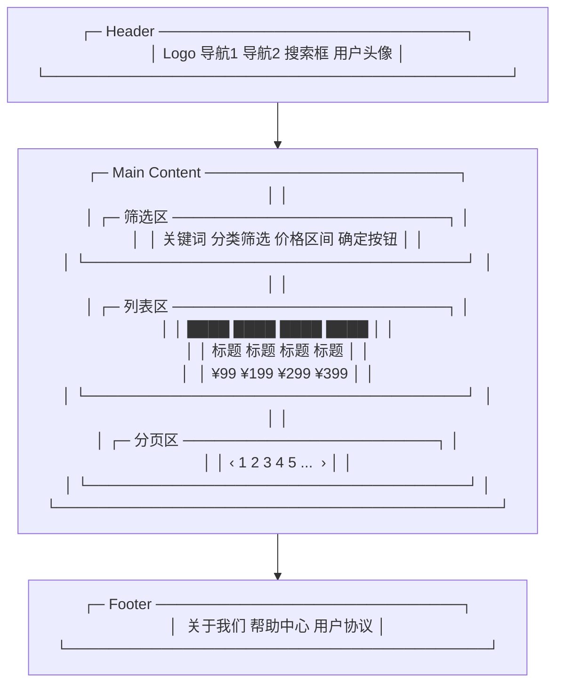
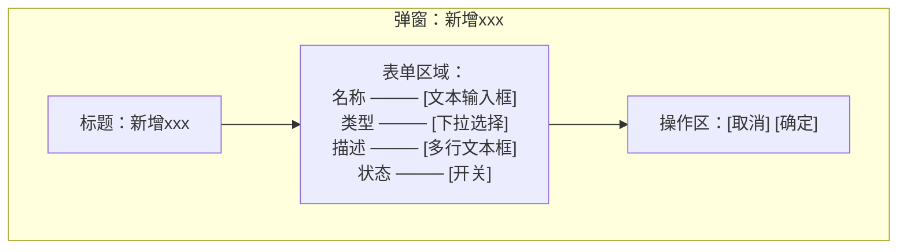
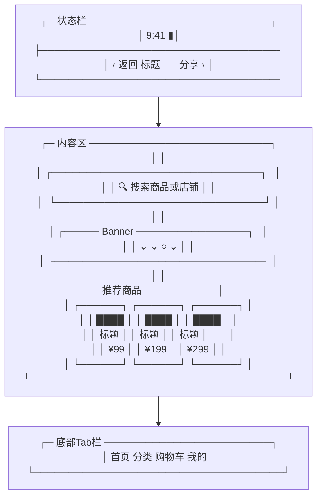

# 原型绘制模板（Text-based Prototype）

本文件是 pm-prd-writer 的参考模板。用于将 PRD 中的功能需求转化为文字版前端原型图，便于评审时快速理解页面结构和交互布局。

---

## 原型结构说明

每个原型包含三部分：

1. **页面信息** — 页面名称、入口路径、访问角色
2. **布局线框图** — 用 Mermaid 绘制的页面区块结构
3. **元素明细表** — 每个 UI 元素的类型、位置、交互说明

---

## 模板示例

### [页面名称] — [页面功能简述]

**页面信息**

| 项目   | 内容        |
|------|-----------|
| 页面名称 | 例：商品列表页   |
| 访问路径 | /products |
| 访问角色 | 普通用户、管理员  |
| 前置条件 | 用户已登录     |

**布局线框图**

使用 Mermaid flowchart 绘制页面区块结构。每个矩形代表一个 UI 区块，说明该区域的核心内容。



**元素明细表**

| 区域 | 元素   | 类型    | 说明            | 交互/规则                 |
|----|------|-------|---------------|-----------------------|
| 头部 | Logo | 图片+链接 | 点击跳转首页        | -                     |
| 头部 | 搜索框  | 文本输入  | 支持模糊搜索        | Enter 触发搜索，输入≥2字符触发联想 |
| 主体 | 关键词  | 文本输入  | 筛选条件          | 与列表搜索联动               |
| 主体 | 分类筛选 | 下拉选择  | 单选分类          | 默认"全部分类"              |
| 主体 | 列表卡片 | 卡片列表  | 4列网格布局，展示商品信息 | 点击卡片跳转详情页             |
| 主体 | 分页器  | 分页组件  | 默认20条/页       | 支持页码跳转、上下页            |
| 底部 | 链接组  | 文字链接  | 辅助导航          | 新页面打开                 |

---

## 复杂交互页面示例

### [页面名称] — 含弹窗/侧边栏的页面

对于包含弹窗、抽屉、步骤引导等交互的页面，使用多个 Mermaid 图表分别绘制各状态。

**主页面布局**

```mermaid
flowchart TD
    TopBar["顶部操作栏"]
    Table["表格区域"]
    TopBar --> Table
    Table -->|点击 "新增 "|Modal["弹窗：新增表单"]
Table -->|点击行 " 编辑 "|Modal
Table -->|点击行 " 删除 "|Confirm["确认弹窗：确认删除？"]
Confirm -->|确认| Toast["Toast：操作成功 + 自动刷新列表"]
Confirm -->|取消|Table
Modal -->|提交成功|Toast
Modal -->|取消|Table
```

**弹窗布局（以"新增"为例）**



**元素明细表**

| 区域 | 元素   | 类型   | 说明   | 交互/规则       |
|----|------|------|------|-------------|
| 弹窗 | 名称   | 文本输入 | 必填   | 1-50字符，超出提示 |
| 弹窗 | 类型   | 下拉选择 | 必填   | 选项从接口获取     |
| 弹窗 | 确定按钮 | 按钮   | 提交表单 | 提交时置灰防重复    |
| 弹窗 | 取消按钮 | 按钮   | 关闭弹窗 | 内容不保存，直接关闭  |

---

## 移动端页面示例



---

## 绘制原则

1. **只画关键页面** — 不是每个页面都需要画原型。选核心流程涉及的主要页面（登录、首页、列表、详情、表单提交、结果页）。
2. **区块级粒度** — 不需要画到每个像素。用方框表示区块，用文字说明区块内的元素。
3. **标注交互** — 用箭头和数据流标注页面跳转、弹窗触发、操作反馈等动态行为。
4. **覆盖状态** — 对同一个页面，覆盖：默认态、空态、错误态、加载态。
5. **移动端与桌面端** — 根据 PRD 中定义的目标用户和使用场景，选择对应的终端线框图风格。
