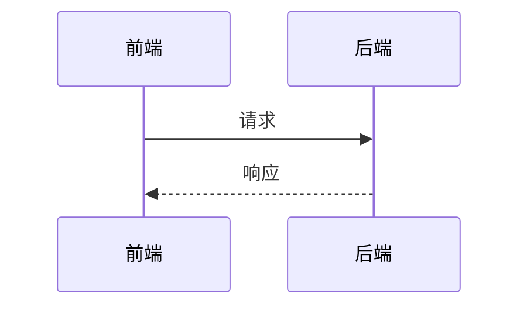

# 任务拆分模板（Feature-level Task Split）

本文件是 pm-prd-writer 的参考模板。用于将 PRD 中的功能模块拆分为独立可执行的开发任务，输出到 `doc/features/` 目录。

---

## 拆分原则

1. **按功能模块拆分** — 每个独立功能对应一个 Feature 文件。功能粒度为"一个完整的用户操作闭环"（例如：用户注册、商品搜索、下单支付）。
2. **接口优先** — 每个 Feature 必须明确定义接口规范（方法、路径、请求/响应格式），这是前后端联调的基础。
3. **数据字典必填** — 每个涉及数据交换的字段都需要定义：字段名、类型、必填、说明、示例值。
4. **异常流程全覆盖** — 每个功能至少覆盖：参数异常、数据不存在、服务异常三种场景。
5. **可测试** — 每个功能需包含验收条件，可直接转化为测试用例。

---

## 文件命名规范

```
F-{两位数序号}-{功能英文短名}.md
```

| 规则   | 示例                       |
|------|--------------------------|
| 序号   | 从 01 开始，按功能模块排序          |
| 英文短名 | 小写字母 + 连字符，见名知意          |
| 示例   | `F-01-user-login.md`     |
| 示例   | `F-02-product-search.md` |

---

## Feature 文件结构

```markdown
# F-{XX} {功能名}（{副标题}）

| 字段   | 值       |
|--------|----------|
| 功能ID | F-{XX}   |
| 模块   | {模块名}  |
| 优先级  | P{0/1/2} |
| 版本   | V{1.0}   |
| 状态   | ⏳ 待开发 |

---

## 1. 描述

一句话描述这个功能做什么。

## 2. 用户故事

```

作为 [角色]，我希望 [操作]，以便 [目的]。

```

## 3. 前置条件

| 类型   | 条件           |
|--------|----------------|
| 数据依赖 | 需要哪些数据已存在 |
| 系统依赖 | 哪些系统/服务已就绪 |
| 权限依赖 | 需要什么角色权限   |

## 4. 后置条件

| 变化     | 说明              |
|----------|-------------------|
| 数据变化   | 新增/修改/删除了什么数据 |
| 通知依赖   | 触发哪些通知         |
| 状态变化   | 业务状态如何流转      |

## 5. 接口规范

| 元素           | 说明              |
|----------------|-------------------|
| 方法           | GET/POST/PUT/DELETE |
| 路径           | /api/xxx           |
| Content-Type   | application/json   |
| 请求体          | 请求参数说明         |
| 响应           | 响应数据说明         |

### 请求体数据字典（按需）

| 字段名   | 类型    | 必填 | 说明   | 示例值  |
|----------|---------|------|--------|---------|
| xxx      | String  | 是   | xxx    | "xxx"   |

### 响应数据字典（按需）

| 字段名   | 类型    | 必填 | 说明   | 示例值  |
|----------|---------|------|--------|---------|
| xxx      | String  | 是   | xxx    | "xxx"   |

## 6. 业务流程

用 Mermaid 绘制。



## 7. 异常/分支流程

| 场景  | 触发条件 | 处理方式 | 提示文案  |
|-----|------|------|-------|
| xxx | xxx  | xxx  | "xxx" |

## 8. 验收标准

| # | 验收条件 | 优先级 |
|---|------|-----|
| 1 | xxx  | P0  |
| 2 | xxx  | P1  |

```

---

## 模块划分参考

根据 PRD 的"功能清单"和"产品框架"章节，将功能归入对应模块。常见模块示例如下：

| 模块名   | 典型功能举例                              |
|----------|-------------------------------------------|
| 用户     | 注册、登录、个人信息、密码重置              |
| 首页     | 内容推荐、公告、快捷入口                    |
| 搜索     | 关键词搜索、高级筛选、搜索结果展示           |
| 内容     | 列表、详情、创建、编辑、删除                 |
| 消息     | 消息通知、推送设置、通知历史                  |
| 订单     | 下单、支付、取消、退款、订单列表              |
| 管理后台  | 数据统计、用户管理、配置管理、日志查询         |

---

## 输出路径

所有 Feature 文件保存到项目根目录的 `doc/features/` 下。目录结构如下：

```

doc/features/
├── F-01-{feature-name}.md
├── F-02-{feature-name}.md
└── ...

```

> 更新已有文件的策略见 SKILL.md 阶段六「更新已有文件」。
