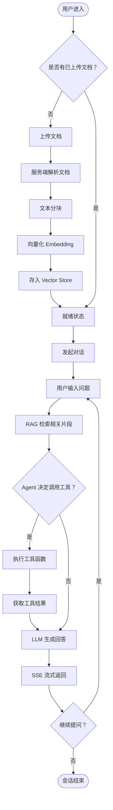
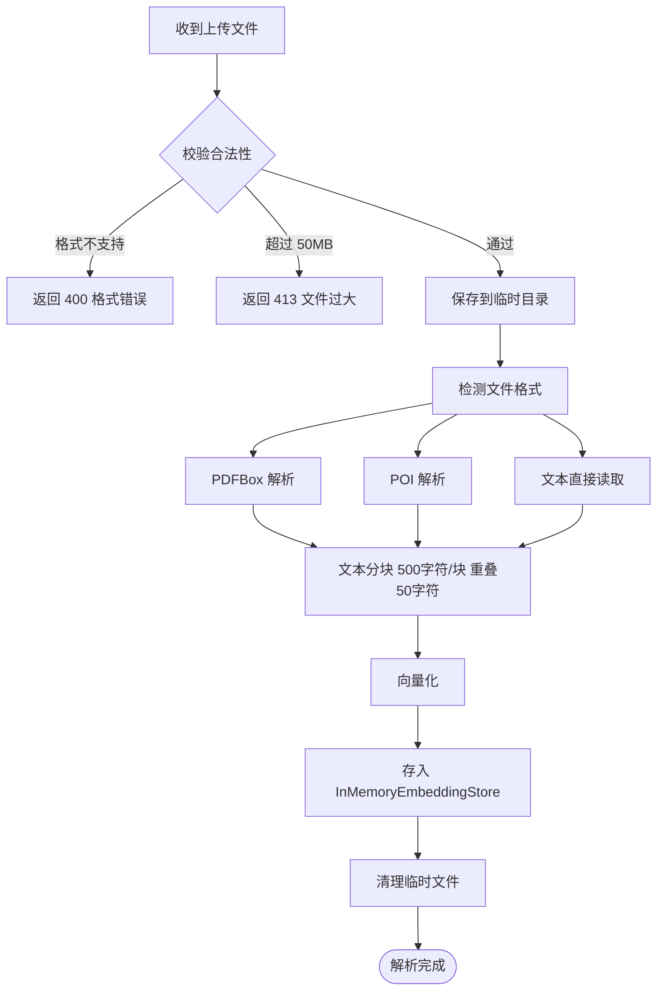
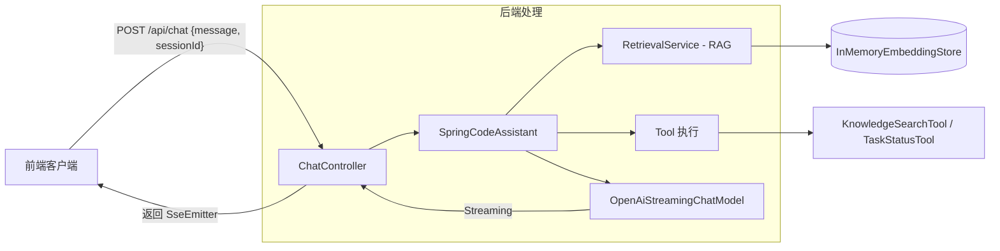
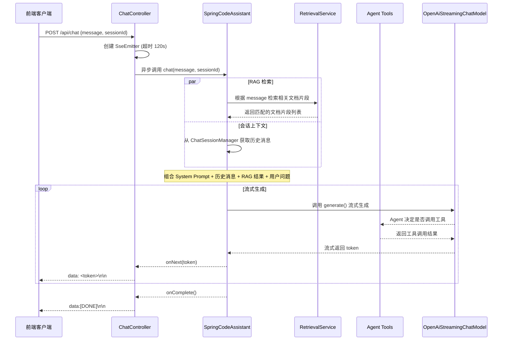
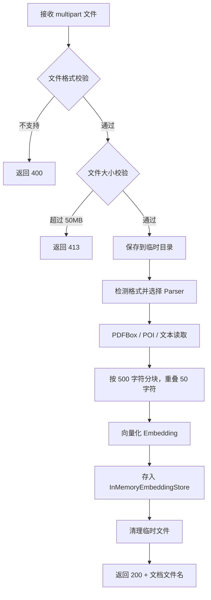
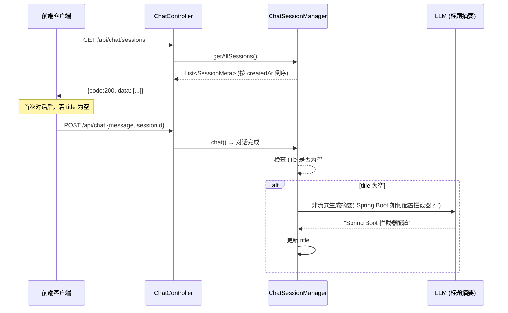

# SmartDoc 智能文档助手 — 产品需求文档 (PRD)

| 版本   | 日期         | 修订人   | 备注                                               |
|------|------------|-------|--------------------------------------------------|
| V1.0 | 2026-06-06 | AI 生成 | 初稿                                               |
| V1.1 | 2026-06-06 | AI 生成 | 结构化优化：补充流程、异常处理、数据字典、埋点、验收标准                     |
| V1.2 | 2026-06-06 | AI 生成 | 评审修订：对齐实现与文档、简化角色模型、修正接口规范、更新待确认项                |
| V1.3 | 2026-06-06 | AI 生成 | 会话管理增强：新增 F-08 会话列表、F-09 重命名、F-10 批量删除、F-11 清空全部 |

## 目录

- [一、概述（为什么做）](#一概述为什么做)
    - [1.1 产品概述及目标](#11-产品概述及目标)
        - [1.1.1 背景介绍](#111-背景介绍)
        - [1.1.2 产品概述](#112-产品概述)
        - [1.1.3 产品目标](#113-产品目标)
        - [1.1.4 目标用户](#114-目标用户)
    - [1.2 名词说明](#12-名词说明)
    - [1.3 角色及权限](#13-角色及权限)
    - [1.4 文档阅读对象](#14-文档阅读对象)
- [二、产品描述（做什么）](#二产品描述做什么)
    - [2.1 产品需求描述](#21-产品需求描述)
    - [2.2 产品整体流程](#22-产品整体流程)
        - [2.2.1 主流程](#221-主流程)
        - [2.2.2 文档解析子流程](#222-文档解析子流程)
        - [2.2.3 对话数据流](#223-对话数据流)
    - [2.3 全局说明](#23-全局说明)
        - [2.3.1 全局异常处理](#231-全局异常处理)
        - [2.3.2 数据空状态规则](#232-数据空状态规则)
        - [2.3.3 全局交互约定](#233-全局交互约定)
    - [2.4 产品版本规划](#24-产品版本规划)
    - [2.5 产品框架](#25-产品框架)
    - [2.6 功能清单](#26-功能清单)
- [三、功能需求（怎么做）](#三功能需求怎么做)
    - [3.1 智能对话（F-01）](#31-智能对话f-01)
        - [3.1.1 描述](#311-描述)
        - [3.1.2 用户故事](#312-用户故事)
        - [3.1.3 前置条件](#313-前置条件)
        - [3.1.4 后置条件](#314-后置条件)
        - [3.1.5 接口规范](#315-接口规范)
        - [3.1.6 业务流程](#316-业务流程)
        - [3.1.7 异常/分支流程](#317-异常分支流程)
        - [3.1.8 数据字典 - SSE 协议](#318-数据字典---sse-协议)
    - [3.2 查看对话历史（F-02）](#32-查看对话历史f-02)
        - [3.2.1 描述](#321-描述)
        - [3.2.2 用户故事](#322-用户故事)
        - [3.2.3 前置条件](#323-前置条件)
        - [3.2.4 后置条件](#324-后置条件)
        - [3.2.5 接口规范](#325-接口规范)
        - [3.2.6 异常/分支流程](#326-异常分支流程)
    - [3.3 清除会话（F-03）](#33-清除会话f-03)
        - [3.3.1 描述](#331-描述)
        - [3.3.2 用户故事](#332-用户故事)
        - [3.3.3 前置条件](#333-前置条件)
        - [3.3.4 后置条件](#334-后置条件)
        - [3.3.5 接口规范](#335-接口规范)
        - [3.3.6 异常/分支流程](#336-异常分支流程)
    - [3.4 上传文档（F-04）](#34-上传文档f-04)
        - [3.4.1 描述](#341-描述)
        - [3.4.2 用户故事](#342-用户故事)
        - [3.4.3 前置条件](#343-前置条件)
        - [3.4.4 后置条件](#344-后置条件)
        - [3.4.5 接口规范](#345-接口规范)
        - [3.4.6 业务流程](#346-业务流程)
        - [3.4.7 异常/分支流程](#347-异常分支流程)
    - [3.5 已上传文档列表（F-05）](#35-已上传文档列表f-05)
        - [3.5.1 描述](#351-描述)
        - [3.5.2 用户故事](#352-用户故事)
        - [3.5.3 前置条件](#353-前置条件)
        - [3.5.4 后置条件](#354-后置条件)
        - [3.5.5 接口规范](#355-接口规范)
        - [3.5.6 异常/分支流程](#356-异常分支流程)
    - [3.6 知识检索工具（F-06）](#36-知识检索工具f-06)
        - [3.6.1 描述](#361-描述)
        - [3.6.2 用户故事](#362-用户故事)
        - [3.6.3 前置条件](#363-前置条件)
        - [3.6.4 后置条件](#364-后置条件)
        - [3.6.5 工具定义](#365-工具定义)
    - [3.7 任务状态查询工具（F-07）](#37-任务状态查询工具f-07)
        - [3.7.1 描述](#371-描述)
        - [3.7.2 用户故事](#372-用户故事)
        - [3.7.3 前置条件](#373-前置条件)
        - [3.7.4 后置条件](#374-后置条件)
        - [3.7.5 工具定义](#375-工具定义)
    - [3.8 会话列表（F-08）](#38-会话列表f-08)
        - [3.8.1 描述](#381-描述)
        - [3.8.2 用户故事](#382-用户故事)
        - [3.8.3 前置条件](#383-前置条件)
        - [3.8.4 后置条件](#384-后置条件)
        - [3.8.5 会话元数据模型](#385-会话元数据模型)
        - [3.8.6 接口规范](#386-接口规范)
        - [3.8.7 业务流程](#387-业务流程)
        - [3.8.8 异常/分支流程](#388-异常分支流程)
    - [3.9 重命名会话（F-09）](#39-重命名会话f-09)
        - [3.9.1 描述](#391-描述)
        - [3.9.2 用户故事](#392-用户故事)
        - [3.9.3 前置条件](#393-前置条件)
        - [3.9.4 后置条件](#394-后置条件)
        - [3.9.5 接口规范](#395-接口规范)
        - [3.9.6 异常/分支流程](#396-异常分支流程)
    - [3.10 批量删除会话（F-10）](#310-批量删除会话f-10)
        - [3.10.1 描述](#3101-描述)
        - [3.10.2 用户故事](#3102-用户故事)
        - [3.10.3 前置条件](#3103-前置条件)
        - [3.10.4 后置条件](#3104-后置条件)
        - [3.10.5 接口规范](#3105-接口规范)
        - [3.10.6 异常/分支流程](#3106-异常分支流程)
    - [3.11 清空所有会话（F-11）](#311-清空所有会话f-11)
        - [3.11.1 描述](#3111-描述)
        - [3.11.2 用户故事](#3112-用户故事)
        - [3.11.3 前置条件](#3113-前置条件)
        - [3.11.4 后置条件](#3114-后置条件)
        - [3.11.5 接口规范](#3115-接口规范)
        - [3.11.6 异常/分支流程](#3116-异常分支流程)
- [四、非功能需求（注意事项）](#四非功能需求注意事项)
    - [4.1 安全与合规](#41-安全与合规)
    - [4.2 统计需求（埋点）](#42-统计需求埋点)
    - [4.3 性能需求](#43-性能需求)
    - [4.4 数据存储与管理](#44-数据存储与管理)
    - [4.5 系统集成](#45-系统集成)
- [五、附录](#五附录)
    - [5.1 验收标准与测试要点](#51-验收标准与测试要点)
    - [5.2 局限性（已知未实现）](#52-局限性已知未实现)
- [待确认项清单（全部已决策，V1.1 按此执行）](#待确认项清单全部已决策v11-按此执行)

---

## 一、概述（为什么做）

### 1.1 产品概述及目标

#### 1.1.1 背景介绍

企业/团队在日常工作中积累了大量文档（技术手册、内部规范、合同条款、研究报告），但缺乏高效的检索手段。用户在需要信息时通常需要：
① 找到文档 → ② 打开文档 → ③ 逐页翻阅 → ④ 找到目标内容。
这一流程在文档量大、内容分散时效率极低。

大语言模型（LLM）和检索增强生成（RAG）技术的成熟，使得"上传文档 → 直接提问 → AI 精准回答"成为可能。本产品基于 LangChain4j
框架构建，定位为通用型智能文档问答后端服务，为前端提供 API + SSE 流式对话能力。

#### 1.1.2 产品概述

SmartDoc 是一款**通用型智能文档问答助手**，基于 LLM + RAG 技术，让用户通过上传文档（PDF/DOCX/TXT）并以自然语言对话的方式查询和检索任意领域的文档内容。后端提供
SSE 流式对话、文档管理、历史记录等 REST API，为前端应用（Web / 小程序 / 桌面端）提供 AI 问答能力底座。

#### 1.1.3 产品目标

**业务目标**

| 目标                | 指标                  | 目标值           | 达成时间     |
|-------------------|---------------------|---------------|----------|
| **[假设]** 积累活跃用户   | 注册/接入应用的活跃用户数       | ≥ 1000        | 上线后 6 个月 |
| **[假设]** 保证服务稳定性  | API 可用性（不含 LLM 第三方） | ≥ 99.9%       | 持续       |
| **[假设]** 控制单次问答成本 | 单次问答平均 LLM Token 消耗 | ≤ 2000 tokens | 持续优化     |

**用户目标**

| 目标用户  | 用户目标                | 衡量指标                  |
|-------|---------------------|-----------------------|
| 知识工作者 | 无需手动翻阅文档，直接通过提问获取答案 | 平均获取答案时间 < 10s        |
| 研究人员  | 基于上传文献进行问答和总结       | 一次对话完成 3 轮以上追问        |
| 企业员工  | 上传企业内部文档后随时提问       | 文档上传后立即可用（解析时间 < 10s） |

#### 1.1.4 目标用户

| 角色      | 描述                                  | 核心诉求                 |
|---------|-------------------------------------|----------------------|
| 知识工作者   | 查询团队规范、项目文档、研究报告的办公人员               | 自然语言检索文档知识，快速获取答案    |
| 研究人员    | 分析学术论文、技术文献的科研人员                    | 基于上传文献进行问答和总结        |
| 企业员工    | 查询内部制度、流程手册、合同条款的企业人员               | 上传企业内部文档后随时提问        |
| 初学者（教学） | 学习 LangChain4j + Spring Boot 集成的开发者 | 理解 AI Agent 各模块职责与交互 |

### 1.2 名词说明

| 名词           | 说明                                                                            |
|--------------|-------------------------------------------------------------------------------|
| RAG          | Retrieval-Augmented Generation，检索增强生成。将检索到的文档片段作为上下文注入 LLM 提示词，使回答基于用户提供的文档内容 |
| LLM          | Large Language Model，大语言模型。本产品支持 DeepSeek 和智谱 GLM                             |
| SSE          | Server-Sent Events，服务器推送事件。服务端向客户端单向推送数据的协议，用于流式返回 AI 回复                      |
| Embedding    | 向量化嵌入。将文本转换为数值向量，用于语义相似度计算                                                    |
| Vector Store | 向量数据库/存储。存储文档向量的容器，当前使用 `InMemoryEmbeddingStore`                              |
| Token        | LLM 处理文本的最小单位（可理解为单词或子词片段）                                                    |
| Session      | 会话。一次对话的上下文单元，包含多轮用户消息和 AI 回复                                                 |
| Agent        | 智能体。本产品中封装了 LLM + RAG + Tools 的 AI 对话代理                                       |

### 1.3 角色及权限

V1.0 不实现用户系统，全部为匿名用户，CORS 全放通。

| 角色              | 权限范围        | 数据范围          | 说明                              |
|-----------------|-------------|---------------|---------------------------------|
| 匿名用户            | 全部功能        | 当前会话数据（服务端内存） | V1.0 唯一角色，sessionId 由前端生成       |
| **[未来版本]** 普通用户 | 全部功能        | 个人数据          | 待 V2.0 接入 Spring Security + JWT |
| **[未来版本]** 管理员  | 全部功能 + 系统管理 | 全部数据          | 待 V2.0                          |

### 1.4 文档阅读对象

| 对象       | 关注内容                |
|----------|---------------------|
| 研发（后端）   | 功能需求、接口规范、数据字典、技术架构 |
| 研发（前端）   | API 接口、SSE 协议格式、错误码 |
| 测试       | 异常流程、验收标准、边界条件      |
| 项目管理     | 产品版本规划、功能清单、优先级     |
| 产品（后续迭代） | 产品目标、局限性、未来方向       |

---

## 二、产品描述（做什么）

### 2.1 产品需求描述

SmartDoc 提供一套后端 API，覆盖以下核心能力：

- **文档管理**：支持上传 PDF/DOCX/TXT（≤ 50MB），自动解析、分块、向量化，存入内存向量库
- **智能对话**：基于用户上传的文档，通过 LLM + RAG + Tools 生成带引用的流式回答
- **会话管理**：支持多轮对话记忆（滑动窗口 20 条），30 分钟未活跃自动清理
- **工具调用**：AI Agent 可主动调用知识检索工具和业务状态查询工具（当前为 stub 实现）
- **多模型切换**：同时兼容 DeepSeek 和智谱 GLM，通过配置切换

**不包含在 MVP 范围内：**

- 用户认证与鉴权系统
- 文档删除/编辑/分类管理
- 外部向量数据库持久化
- 前端 UI（仅提供 API）

### 2.2 产品整体流程

#### 2.2.1 主流程



#### 2.2.2 文档解析子流程



#### 2.2.3 对话数据流



### 2.3 全局说明

#### 2.3.1 全局异常处理

| 异常场景                   | 处理方式                                                             | HTTP 状态码 | 响应示例                                                                                           |
|------------------------|------------------------------------------------------------------|----------|------------------------------------------------------------------------------------------------|
| 请求参数校验失败               | `@Valid` + `@NotBlank` 校验不通过                                     | 400      | `{"code":400,"msg":"<字段名>: <校验失败原因>"}`                                                         |
| 文件超过大小限制               | `MaxUploadSizeExceededException`                                 | 413      | `{"code":413,"msg":"File size exceeds the maximum allowed limit (50 MB)"}`                     |
| 上传文件处理失败（格式/解析/向量化/磁盘） | `Exception` 通用捕获                                                 | 200      | `{"code":400,"msg":"Failed to process document. Please check the file format and try again."}` |
| 会话不存在                  | 返回空历史                                                            | 200      | `{"code":200,"data":[]}`                                                                       |
| SSE 连接中断               | 客户端重新发起请求（已生成的部分回答不保留）                                           | -        | 断开后服务端通过 `onCompletion` 回调取消 LLM 调用                                                            |
| LLM 调用超时/失败            | 服务端调用 `emitter.completeWithError()`，客户端 `EventSource.onerror` 触发 | -        | 前端应监听 `onerror` 事件并展示"服务暂不可用"提示                                                                |
| 服务端内部错误                | 返回通用错误                                                           | 500      | `{"code":500,"msg":"服务器内部错误"}`                                                                 |

#### 2.3.2 数据空状态规则

| 场景         | 展示方式                         |
|------------|------------------------------|
| 对话历史为空     | 返回空数组 `[]`                   |
| 文档列表为空     | 返回空数组 `[]`                   |
| RAG 检索无结果  | Agent 在回复中说明"未在已上传文档中找到相关信息" |
| 会话已过期/已被清理 | 视为新会话，返回空历史                  |

#### 2.3.3 全局交互约定

| 场景         | 交互方式                                      |
|------------|-------------------------------------------|
| SSE 流式输出   | 每 token 以 `data:` 前缀推送，以 `data:[DONE]` 结束 |
| 表单提交（上传）   | 按钮置灰防止重复提交，显示上传进度                         |
| 异步操作（文档解析） | 上传接口同步等待解析完成；大文件可考虑异步模式                   |
| 服务端错误      | 流式推送错误事件后关闭连接                             |

### 2.4 产品版本规划

| 版本       | 范围          | 包含功能                                                                            | 计划时间             | 状态  |
|----------|-------------|---------------------------------------------------------------------------------|------------------|-----|
| V1.0 MVP | 核心对话 + 文档上传 | F-01 智能对话, F-04 文档上传, F-05 文档列表                                                 | **[假设]** 2026-Q2 | 进行中 |
| V1.1     | 会话管理 + 工具增强 | F-02 对话历史, F-03 清除会话, F-08 会话列表, F-09 重命名会话, F-10 批量删除, F-11 清空全部, F-06/F-07 工具 | **[假设]** 2026-Q3 | 规划中 |
| V2.0     | 生产级完善       | 用户认证、外部向量库、文档删除、文件 OSS 存储、前端 UI                                                 | **[假设]** 2026-Q4 | 远期  |

### 2.5 产品框架

```
┌─────────────────────────────────────────────────────────────┐
│                      API 网关层 (smartdoc-api)                 │
│  ChatController / DocumentController / AppConfig / Exception │
└────────────┬────────────────────┬────────────────────────────┘
             │                    │
    ┌────────▼────────┐  ┌───────▼────────┐
    │  对话服务层       │  │  Agent 工具层   │
    │  smartdoc-chat   │  │ smartdoc-tools │
    │  SpringCodeAssist│  │ KnowledgeSearch│
    │  ChatSessionMgr  │  │ TaskStatusTool │
    │  ChatConfig      │  │  (stub)       │
    └────────┬────────┘  └────────────────┘
             │
    ┌────────▼────────┐
    │   RAG 检索层     │
    │  smartdoc-rag   │
    │  DocumentIngest │
    │  RetrievalService│
    │  InMemoryStore  │
    └────────┬────────┘
             │
    ┌────────▼─────────┐
    │   LLM 接入层      │
    │ smartdoc-chatModel│
    │ ChatModelConfig   │
    │ EmbeddingConfig   │
    │ OpenAiChatModel   │
    │ AllMiniLmL6V2Embed│
    └──────────────────┘
             │
    ┌────────▼────────┐
    │  公共 DTO 层     │
    │ smartdoc-common │
    └─────────────────┘
```

模块依赖方向（严格单向，禁止循环）：

```
smartdoc-common ← smartdoc-chatModel ← smartdoc-rag ← smartdoc-tools ← smartdoc-chat ← smartdoc-api
```

### 2.6 功能清单

| 模块 | 功能ID | 功能           | 优先级 | 版本   | 状态      | 说明                          |
|----|------|--------------|-----|------|---------|-----------------------------|
| 对话 | F-01 | 智能对话（SSE 流式） | P0  | V1.0 | ✅ 已完成   | 核心功能，流式返回 AI 回复             |
| 对话 | F-02 | 查看对话历史       | P1  | V1.1 | ✅ 已完成   | 按 sessionId 查询历史消息          |
| 对话 | F-03 | 清除会话         | P2  | V1.1 | ✅ 已完成   | 删除指定会话的对话记忆                 |
| 文档 | F-04 | 上传文档         | P0  | V1.0 | ✅ 已完成   | 支持 PDF/DOCX/TXT，自动解析向量化     |
| 文档 | F-05 | 已上传文档列表      | P1  | V1.0 | ✅ 已完成   | 返回所有已上传文档文件名清单              |
| 工具 | F-06 | 知识库搜索工具      | P2  | V1.1 | ⚠️ stub | Agent 工具，当前为 stub           |
| 工具 | F-07 | 业务办理状态查询工具   | P2  | V1.1 | ⚠️ stub | Agent 工具，当前为 stub           |
| 对话 | F-08 | 会话列表         | P1  | V1.1 | ✅ 已完成   | 返回所有活跃会话元数据（标题、消息数、时间），支持分页 |
| 对话 | F-09 | 重命名会话        | P2  | V1.1 | ✅ 已完成   | AI 自动摘要生成标题 + 用户手动修改        |
| 对话 | F-10 | 批量删除会话       | P2  | V1.1 | ✅ 已完成   | 一次删除多个指定会话                  |
| 对话 | F-11 | 清空所有会话       | P2  | V1.1 | ✅ 已完成   | 删除全部活跃会话                    |

---

## 三、功能需求（怎么做）

### 3.1 智能对话（F-01）

#### 3.1.1 描述

用户发送消息，AI Agent 结合系统提示词 + RAG 检索内容 + 工具调用结果，通过 SSE 流式返回 AI 回复。

#### 3.1.2 用户故事

```
作为 [知识工作者]，我希望 [对上传的文档进行自然语言提问]，以便 [快速获取文档中的关键信息]。
作为 [研究人员]，我希望 [对上传的文献进行多轮追问]，以便 [深入理解文献内容]。
```

#### 3.1.3 前置条件

| 类型   | 条件                                            |
|------|-----------------------------------------------|
| 数据依赖 | 至少有一个文档已上传并完成向量化（否则 RAG 检索返回空，Agent 会告知无可用文档） |
| 系统依赖 | LLM API Key 已配置且校验通过                          |

#### 3.1.4 后置条件

| 变化     | 说明                   |
|--------|----------------------|
| 对话历史   | 用户消息和 AI 回复追加到当前会话历史 |
| 会话活跃时间 | 更新会话最后活跃时间，延迟自动清理计时  |

#### 3.1.5 接口规范

| 元素           | 说明                                                |
|--------------|---------------------------------------------------|
| 方法           | `POST /api/chat`                                  |
| Content-Type | `application/json`                                |
| Accept       | `text/event-stream`                               |
| 请求体          | `{"message": "用户问题", "sessionId": "会话ID"}`        |
| SSE 超时       | 120s（超过后服务端自动断开连接，需客户端重试）                         |
| 响应           | SSE 流，`data: <token>` 逐 token 推送，`data:[DONE]` 结束 |

**请求体数据字典：**

| 字段名       | 类型           | 必填 | 说明                                            | 示例值                                    |
|-----------|--------------|----|-----------------------------------------------|----------------------------------------|
| message   | String(2000) | 是  | 用户输入的问题文本（校验 `@NotBlank` + `@Size(max=2000)`） | "Spring Boot 如何配置拦截器？"                 |
| sessionId | String(64)   | 否  | 会话标识，由前端生成（UUID）。为空时服务端使用 `"default"` 作为回退值   | "a1b2c3d4-e5f6-7890-abcd-ef1234567890" |

#### 3.1.6 业务流程



#### 3.1.7 异常/分支流程

| 场景         | 触发条件                         | 处理方式                                                            | 提示                                                                   |
|------------|------------------------------|-----------------------------------------------------------------|----------------------------------------------------------------------|
| message 为空 | 请求体缺少 message 字段或为空字符串       | 返回 400 错误                                                       | `"message 不能为空"`                                                     |
| message 超长 | message 超过 2000 字符           | 返回 400 错误                                                       | `"message 不能超过 2000 字符"`                                             |
| LLM 调用超时   | 第三方 LLM API 超时（> 30s）        | 服务端调用 `emitter.completeWithError()`，客户端触发 `EventSource.onerror` | 前端展示"服务暂不可用"                                                         |
| LLM 调用失败   | API Key 无效/额度耗尽/网络错误         | 服务端调用 `emitter.completeWithError()`，客户端触发 `EventSource.onerror` | 前端展示"服务暂不可用"                                                         |
| RAG 检索异常   | 向量库异常或检索失败                   | Agent 忽略 RAG 结果，仅基于 LLM 自身知识回答                                  | -                                                                    |
| SSE 连接中断   | 客户端断开连接（网络异常/浏览器关闭）          | 服务端 `onCompletion` 回调中调用 `future.cancel(true)` 取消 LLM 流式调用      | 已生成的部分回答不保留                                                          |
| 并发同会话对话    | 同一 sessionId 第二次请求到达时前一个仍在处理 | 后一个请求 `SseEmitter.completeWithError()`，返回 503                   | `"当前会话正在处理中，请稍后重试"`（通过 `ConcurrentHashMap` + `AtomicBoolean` 实现会话级锁） |

#### 3.1.8 数据字典 - SSE 协议

| 事件类型  | 数据格式                          | 说明       | 前端处理方式             |
|-------|-------------------------------|----------|--------------------|
| Token | `data:<文本片段>\n\n`             | 正常回复文本   | 拼接 token 渲染到界面     |
| Error | `data:{"error":"<错误信息>"}\n\n` | 异常事件     | 解析 JSON 后展示错误，关闭连接 |
| 结束    | `data:[DONE]\n\n`             | 流式输出结束标记 | 关闭连接，结束渲染          |

### 3.2 查看对话历史（F-02）

#### 3.2.1 描述

按会话 ID 查询历史对话消息（只返回用户和 AI 消息，过滤系统提示）。

#### 3.2.2 用户故事

```
作为 [用户]，我希望 [查看之前的对话内容]，以便 [追溯之前的问答或继续未完成的讨论]。
```

#### 3.2.3 前置条件

| 类型   | 条件                              |
|------|---------------------------------|
| 数据依赖 | 有对应的 sessionId 存在（未过期/未被清除）     |
| 参数依赖 | sessionId 不能为空                  |
| 前置依赖 | 会话必须存在（F-08 列表中的 sessionId 均可查） |

#### 3.2.4 后置条件

| 变化     | 说明                           |
|--------|------------------------------|
| 会话活跃时间 | 查询操作**不**更新会话最后活跃时间（仅对话操作更新） |

#### 3.2.5 接口规范

| 元素   | 说明                                                                       |
|------|--------------------------------------------------------------------------|
| 方法   | `GET /api/chat/history/{sessionId}`                                      |
| 请求参数 | 路径参数 sessionId                                                           |
| 响应   | `[{"role":"user","content":"..."},{"role":"assistant","content":"..."}]` |

**响应数据字典：**

| 字段名     | 类型           | 必填 | 说明                        | 示例值                    |
|---------|--------------|----|---------------------------|------------------------|
| role    | Enum(String) | 是  | 消息角色：`user` 或 `assistant` | "user"                 |
| content | String       | 是  | 消息内容                      | "Spring Boot 如何配置拦截器？" |

#### 3.2.6 异常/分支流程

| 场景           | 触发条件               | 处理方式        | 提示                 |
|--------------|--------------------|-------------|--------------------|
| sessionId 为空 | 路径参数为空             | 返回 400      | `"sessionId 不能为空"` |
| 会话不存在        | sessionId 未找到或已被清理 | 返回空数组       | `[]`               |
| 会话已过期        | 会话超过 30 分钟未活跃      | 返回空数组（同不存在） | `[]`               |

### 3.3 清除会话（F-03）

#### 3.3.1 描述

删除指定会话的对话记忆。

#### 3.3.2 用户故事

```
作为 [用户]，我希望 [清除不需要的会话记录]，以便 [释放资源或重新开始对话]。
```

#### 3.3.3 前置条件

| 类型   | 条件             |
|------|----------------|
| 参数依赖 | sessionId 不能为空 |

#### 3.3.4 后置条件

| 变化   | 说明                                |
|------|-----------------------------------|
| 会话数据 | 从 `ChatSessionManager` 移除该会话的所有消息 |
| 下次对话 | 该 sessionId 被视为新会话，无历史上下文         |

#### 3.3.5 接口规范

| 元素 | 说明                                        |
|----|-------------------------------------------|
| 方法 | `GET /api/chat/session/clear/{sessionId}` |
| 响应 | `AjaxResult`                              |

**响应数据字典：**

| 字段名  | 类型      | 必填 | 说明   | 示例值       |
|------|---------|----|------|-----------|
| code | Integer | 是  | 状态码  | 200       |
| msg  | String  | 是  | 提示信息 | "success" |
| data | Object  | 否  | 无数据  | null      |

#### 3.3.6 异常/分支流程

| 场景           | 触发条件          | 处理方式        | 提示                 |
|--------------|---------------|-------------|--------------------|
| sessionId 为空 | 路径参数为空        | 返回 400      | `"sessionId 不能为空"` |
| 会话不存在        | sessionId 未找到 | 仍返回成功（幂等操作） | 同正常响应              |

### 3.4 上传文档（F-04）

#### 3.4.1 描述

上传文档并自动解析、分块、向量化后存入内存向量库，供后续 RAG 检索。

#### 3.4.2 用户故事

```
作为 [用户]，我希望 [上传文档到系统]，以便 [AI 能够基于我的文档内容回答问题]。
```

#### 3.4.3 前置条件

| 类型   | 条件                                                        |
|------|-----------------------------------------------------------|
| 文件校验 | 文件大小 ≤ 50MB（由 Spring `MaxUploadSizeExceededException` 拦截） |
| 文件校验 | 文件格式为 PDF / DOCX / DOC / TXT 之一                           |
| 文件校验 | 文件名经过 `Path.getFileName()` 清洗，防路径遍历                       |
| 系统依赖 | Embedding 模型可用（本地 ONNX 或远程 API）                           |

#### 3.4.4 后置条件

| 变化   | 说明                                                                                                          |
|------|-------------------------------------------------------------------------------------------------------------|
| 向量库  | 文档片段向量化后追加到 `InMemoryEmbeddingStore`                                                                        |
| 文档列表 | 文档文件名追加到 `DocumentController.uploadedDocuments`（`CopyOnWriteArrayList`），同时持久化到 `data/document-registry.txt` |
| 临时文件 | 上传的临时文件（`data/temp/`）在解析完成后通过 `Files.deleteIfExists()` 清理                                                   |

#### 3.4.5 接口规范

| 元素           | 说明                            |
|--------------|-------------------------------|
| 方法           | `POST /api/documents/upload`  |
| Content-Type | `multipart/form-data`         |
| 文件字段名        | `file`                        |
| 支持格式         | PDF, DOCX, DOC, TXT           |
| 大小限制         | 最大 50MB                       |
| 响应           | `AjaxResult`（成功时 data 为文档文件名） |

**请求数据字典：**

| 字段名  | 类型   | 必填 | 说明               | 示例值                     |
|------|------|----|------------------|-------------------------|
| file | File | 是  | 上传文档文件           | -                       |
| 文件格式 | -    | 校验 | PDF/DOCX/DOC/TXT | "Spring Boot Guide.pdf" |
| 文件大小 | -    | 校验 | ≤ 50MB           | "10MB"                  |

**响应数据字典：**

| 字段名  | 类型      | 必填 | 说明    | 示例值                     |
|------|---------|----|-------|-------------------------|
| code | Integer | 是  | 状态码   | 200                     |
| msg  | String  | 是  | 提示信息  | "上传成功"                  |
| data | String  | 是  | 文档文件名 | "Spring Boot Guide.pdf" |

#### 3.4.6 业务流程



#### 3.4.7 异常/分支流程

| 场景             | 触发条件                                                   | 处理方式                                                 | 提示                                                                          | 说明                                    |
|----------------|--------------------------------------------------------|------------------------------------------------------|-----------------------------------------------------------------------------|---------------------------------------|
| 未上传文件或参数名称错误   | 请求中没有 `file` 字段                                        | Spring 自动返回 400                                      | `"Required request part 'file' is not present"`                             | 由 Spring 框架自动处理                       |
| 文件过大           | 文件 > 50MB                                              | `GlobalExceptionHandler` 返回 413                      | `"File size exceeds the maximum allowed limit (50 MB)"`                     | 由 `MaxUploadSizeExceededException` 触发 |
| 格式不支持或解析/向量化失败 | 文件后缀不对 / PDF 损坏 / DOCX 加密 / 编码异常 / Embedding 异常 / 磁盘不足 | 捕获所有 `Exception`，返回 HTTP 200 + `AjaxResult.failed()` | `"Failed to process document. Please check the file format and try again."` | 当前未区分具体错误类型，统一返回通用错误                  |
| 同名文件重复上传       | 上传已存在文件名的文档                                            | 追加到向量库，不覆盖                                           | -                                                                           | 同一文档重复上传会导致向量库中有两份，但不阻塞操作             |

### 3.5 已上传文档列表（F-05）

#### 3.5.1 描述

返回所有已上传到向量库的文档文件名清单。

#### 3.5.2 用户故事

```
作为 [用户]，我希望 [查看已上传了哪些文档]，以便 [了解当前知识库的内容范围]。
```

#### 3.5.3 前置条件

无。

#### 3.5.4 后置条件

无状态变更。

#### 3.5.5 接口规范

| 元素 | 说明                                   |
|----|--------------------------------------|
| 方法 | `GET /api/documents`                 |
| 响应 | `AjaxResult<String[]>` — data 为字符串数组 |

**响应数据字典：**

| 字段名  | 类型       | 必填 | 说明    | 示例值                    |
|------|----------|----|-------|------------------------|
| code | Integer  | 是  | 状态码   | 200                    |
| msg  | String   | 是  | 提示信息  | "success"              |
| data | String[] | 是  | 文件名数组 | `["手册.pdf","规范.docx"]` |

#### 3.5.6 异常/分支流程

| 场景  | 触发条件  | 处理方式  | 提示                       |
|-----|-------|-------|--------------------------|
| 无文档 | 向量库为空 | 返回空数组 | `{"code":200,"data":[]}` |

### 3.6 知识检索工具（F-06）

#### 3.6.1 描述

AI Agent 可主动调用的工具，根据关键词搜索知识库中的文档片段。当前为 stub 实现，返回硬编码 JSON。

#### 3.6.2 用户故事

```
作为 [AI Agent]，我希望 [根据用户问题检索知识库中的相关文档片段]，以便 [在回答时引用文档内容]。
```

#### 3.6.3 前置条件

| 类型   | 条件                  |
|------|---------------------|
| 系统依赖 | Agent 在对话过程中决定调用此工具 |
| 数据依赖 | 向量库中有已上传的文档         |

#### 3.6.4 后置条件

工具返回结果注入 LLM 提示词，影响最终回答。

#### 3.6.5 工具定义

| 元素   | 说明                          |
|------|-----------------------------|
| 注解   | `@Tool("根据关键词搜索知识库中的文档片段")` |
| 当前状态 | **模拟实现** — 返回硬编码 JSON 示例数据  |
| 后续计划 | 对接 `RetrievalService` 真实检索  |

### 3.7 任务状态查询工具（F-07）

#### 3.7.1 描述

AI Agent 可主动调用的工具，查询任务或业务的办理状态。当前为 stub 实现，返回硬编码 JSON。

#### 3.7.2 用户故事

```
作为 [AI Agent]，我希望 [查询业务任务的当前办理状态]，以便 [向用户反馈进度信息]。
```

#### 3.7.3 前置条件

| 类型   | 条件                  |
|------|---------------------|
| 系统依赖 | Agent 在对话过程中决定调用此工具 |

#### 3.7.4 后置条件

工具返回结果注入 LLM 提示词，影响最终回答。

#### 3.7.5 工具定义

| 元素   | 说明                         |
|------|----------------------------|
| 注解   | `@Tool("查询任务或业务的办理状态")`    |
| 当前状态 | **模拟实现** — 返回硬编码 JSON 模拟数据 |
| 后续计划 | 对接真实业务数据库或第三方审批系统          |

---

### 3.8 会话列表（F-08）

#### 3.8.1 描述

返回所有活跃会话的元数据列表。每次用户发起对话时，系统自动根据第一轮用户消息摘要生成会话标题；用户可后续手动修改。

#### 3.8.2 用户故事

```
作为 [用户]，我希望 [查看所有历史会话的列表]，以便 [快速找到之前的对话并继续讨论]。
作为 [用户]，我希望 [列表展示会话标题、消息条数和时间]，以便 [快速识别会话内容]。
```

#### 3.8.3 前置条件

无（空列表时返回 `[]`）。

#### 3.8.4 后置条件

无状态变更。

#### 3.8.5 会话元数据模型

| 字段           | 类型          | 必填 | 说明                | 生成方式             |
|--------------|-------------|----|-------------------|------------------|
| sessionId    | String(64)  | 是  | 会话唯一标识（UUID）      | 前端生成             |
| title        | String(100) | 否  | 会话标题，为空时前端展示"新会话" | AI 自动摘要 或 用户手动设置 |
| createdAt    | Long        | 是  | 创建时间戳（ms）         | 首次对话时记录          |
| lastActiveAt | Long        | 是  | 最后活跃时间戳（ms）       | 每次对话更新           |
| messageCount | Integer     | 是  | 消息总条数（用户 + AI）    | 每次对话递增           |

**标题自动摘要规则：**

- 触发时机：每轮对话完成后，如果该会话 `title` 为空，则以**第一轮用户消息**作为输入调用 LLM 生成简短标题（≤ 20 字）
- 幂等性：标题生成后不再自动覆盖，除非用户主动触发「重新生成标题」
- LLM 调用：复用现有的 `OpenAiStreamingChatModel`，非流式单次调用
- 超时处理：LLM 生成超时（> 5s）则跳过，下次对话时重试

#### 3.8.6 接口规范

| 元素   | 说明                           |
|------|------------------------------|
| 方法   | `GET /api/chat/sessions`     |
| 请求参数 | 无                            |
| 排序   | **按创建时间倒序**（最新创建的排最前）        |
| 响应   | `AjaxResult` — data 为会话元数据数组 |

**响应数据字典：**

| 字段名                 | 类型            | 必填 | 说明      | 示例值                 |
|---------------------|---------------|----|---------|---------------------|
| code                | Integer       | 是  | 状态码     | 200                 |
| msg                 | String        | 是  | 提示信息    | "success"           |
| data                | SessionMeta[] | 是  | 会话元数据数组 | —                   |
| data[].sessionId    | String        | 是  | 会话 ID   | "a1b2c3d4-..."      |
| data[].title        | String        | 否  | 会话标题    | "Spring Boot 配置拦截器" |
| data[].createdAt    | Long          | 是  | 创建时间戳   | 1718000000000       |
| data[].lastActiveAt | Long          | 是  | 最后活跃时间戳 | 1718003600000       |
| data[].messageCount | Integer       | 是  | 消息总条数   | 6                   |

#### 3.8.7 业务流程



#### 3.8.8 异常/分支流程

| 场景       | 触发条件        | 处理方式            | 提示   |
|----------|-------------|-----------------|------|
| 无任何会话    | 会话管理器为空     | 返回空数组           | `[]` |
| 标题自动摘要失败 | LLM 调用超时/异常 | 静默跳过，title 保持为空 | —    |
| 会话已过期被清理 | 30 分钟未活跃    | 不返回该会话（同不存在）    | —    |

### 3.9 重命名会话（F-09）

#### 3.9.1 描述

允许用户手动修改会话标题，或触发 AI 重新生成摘要。

#### 3.9.2 用户故事

```
作为 [用户]，我希望 [修改会话标题]，以便 [能按自己的习惯组织和识别会话]。
作为 [用户]，我希望 [让 AI 重新生成摘要]，以便 [获得更准确的标题描述]。
```

#### 3.9.3 前置条件

| 类型   | 条件                                            |
|------|-----------------------------------------------|
| 数据依赖 | sessionId 对应的会话必须存在                           |
| 参数依赖 | 请求体中 sessionId 不能为空，title 或 regenerate 至少提供一个 |

#### 3.9.4 后置条件

| 变化   | 说明                                    |
|------|---------------------------------------|
| 会话标题 | 更新为新的 title 值（手动模式），或触发 AI 重新生成（自动模式） |

#### 3.9.5 接口规范

**手动修改标题：**

| 元素           | 说明                                     |
|--------------|----------------------------------------|
| 方法           | `PUT /api/chat/session/title`          |
| Content-Type | `application/json`                     |
| 请求体          | `{"sessionId": "...", "title": "新标题"}` |
| 响应           | `AjaxResult`                           |

**触发 AI 重新生成标题：**

| 元素           | 说明                                        |
|--------------|-------------------------------------------|
| 方法           | `POST /api/chat/session/title/regenerate` |
| Content-Type | `application/json`                        |
| 请求体          | `{"sessionId": "..."}`                    |
| 响应           | `AjaxResult` — data 为新生成的标题               |
| 处理逻辑         | 取该会话最新一条用户消息作为 LLM 输入，生成 ≤ 20 字摘要         |

**请求体数据字典（通用）：**

| 字段名        | 类型          | 必填 | 说明           | 示例值                |
|------------|-------------|----|--------------|--------------------|
| sessionId  | String(64)  | 是  | 会话 ID        | "a1b2c3d4-..."     |
| title      | String(100) | 否  | 新标题（手动模式必填）  | "Spring Boot 学习笔记" |
| regenerate | Boolean     | 否  | 是否触发 AI 重新生成 | true               |

#### 3.9.6 异常/分支流程

| 场景           | 触发条件              | 处理方式               | 提示               |
|--------------|-------------------|--------------------|------------------|
| sessionId 为空 | 请求体缺少 sessionId   | 返回 400             | "sessionId 不能为空" |
| 会话不存在        | sessionId 未找到或已过期 | 返回 404             | "会话不存在或已过期"      |
| title 超长     | title > 100 字符    | 返回 400             | "标题不能超过 100 字符"  |
| title 为空字符串  | title 为空白字符串      | 返回 400             | "标题不能为空"         |
| 重新生成时 LLM 失败 | LLM 调用超时/异常       | 返回 200 + data 为原标题 | 不清除原标题           |

### 3.10 批量删除会话（F-10）

#### 3.10.1 描述

一次请求删除多个指定会话，释放内存。

#### 3.10.2 用户故事

```
作为 [用户]，我希望 [一次性删除多个不需要的会话]，以便 [快速清理空间]。
```

#### 3.10.3 前置条件

| 类型   | 条件                         |
|------|----------------------------|
| 参数依赖 | sessionIds 数组不能为空且至少包含一个元素 |

#### 3.10.4 后置条件

| 变化   | 说明                                               |
|------|--------------------------------------------------|
| 会话数据 | 从 `ChatSessionManager` 中移除所有指定 sessionId 的消息和元数据 |

#### 3.10.5 接口规范

| 元素           | 说明                                    |
|--------------|---------------------------------------|
| 方法           | `POST /api/chat/sessions/batch`       |
| Content-Type | `application/json`                    |
| 请求体          | `{"sessionIds": ["id1","id2","id3"]}` |
| 响应           | `AjaxResult`                          |

**请求体数据字典：**

| 字段名        | 类型       | 必填 | 说明                    | 示例值           |
|------------|----------|----|-----------------------|---------------|
| sessionIds | String[] | 是  | 待删除的会话 ID 数组（最大 50 个） | ["id1","id2"] |

#### 3.10.6 异常/分支流程

| 场景              | 触发条件              | 处理方式                 | 提示                |
|-----------------|-------------------|----------------------|-------------------|
| sessionIds 为空   | 数组为 null 或长度为 0   | 返回 400               | "sessionIds 不能为空" |
| sessionIds 超过上限 | > 50 个            | 返回 400               | "一次最多删除 50 个会话"   |
| 部分会话不存在         | 某些 sessionId 不存在  | 静默跳过不存在的 ID，删除存在的 ID | 仍返回成功             |
| 全部会话不存在         | 所有 sessionId 均不存在 | 幂等处理，返回成功            | 同正常响应             |

### 3.11 清空所有会话（F-11）

#### 3.11.1 描述

一键删除所有活跃会话。

#### 3.11.2 用户故事

```
作为 [用户]，我希望 [一键清空所有会话]，以便 [重置整个对话环境]。
```

#### 3.11.3 前置条件

无。

#### 3.11.4 后置条件

| 变化   | 说明                                |
|------|-----------------------------------|
| 会话数据 | `ChatSessionManager` 清空所有会话消息和元数据 |
| 后续对话 | 所有 sessionId 被视为新会话               |

#### 3.11.5 接口规范

| 元素 | 说明                              |
|----|---------------------------------|
| 方法 | `POST /api/chat/sessions/clear` |
| 响应 | `AjaxResult`                    |

#### 3.11.6 异常/分支流程

| 场景    | 触发条件    | 处理方式      |
|-------|---------|-----------|
| 无任何会话 | 会话列表已为空 | 幂等操作，返回成功 |

**安全说明**：清空操作**仅涉及当前应用实例的内存数据**（多实例部署下不清除其他实例的数据）。

---

## 四、非功能需求（注意事项）

### 4.1 安全与合规

| 需求           | 说明                                          | 当前状态   |
|--------------|---------------------------------------------|--------|
| API Key 管理   | 通过环境变量注入，不硬编码，启动时校验是否为占位符                   | ✅ 已实现  |
| CORS 策略      | 全放通（开发阶段）                                   | ✅ 已实现  |
| 文件上传安全       | 限制文件类型和大小，文件名经 `Path.getFileName()` 清洗防路径遍历 | ✅ 已实现  |
| 敏感内容检测       | V1.0 不做，用户上传内容无脱敏/审核                        | ❌ 不做   |
| 审计日志         | V1.0 不需要                                    | ❌ 不做   |
| 合规要求（个人信息保护） | 当前纯内存，不持久化用户数据，暂不涉及                         | — 暂不涉及 |

### 4.2 统计需求（埋点）

> V1.0 不做埋点，以下为预留设计，后续版本按需启用。

| 事件名                    | 触发时机        | 属性                                           | 说明       |
|------------------------|-------------|----------------------------------------------|----------|
| `doc_upload`           | 文档上传成功      | `file_name, file_size, file_type`            | 文档上传统计   |
| `doc_upload_fail`      | 文档上传失败      | `file_name, reason`                          | 上传失败监控   |
| `chat_start`           | 用户发起对话      | `session_id`                                 | 对话发起统计   |
| `chat_turn`            | 每次用户消息发送    | `session_id, message_length, has_rag_result` | 对话轮次统计   |
| `chat_complete`        | SSE 流式输出完成  | `session_id, total_tokens, duration_ms`      | 对话完成统计   |
| `chat_error`           | LLM 调用失败/超时 | `session_id, error_type`                     | 错误监控     |
| `tool_call`            | Agent 调用工具  | `tool_name`                                  | 工具使用统计   |
| `session_evict`        | 会话被自动清理     | `session_id, live_minutes`                   | 会话生命周期统计 |
| `session_list`         | 用户查看会话列表    | `session_count`                              | 会话列表查看统计 |
| `session_rename`       | 用户修改标题      | `source`(`manual`/`auto`)                    | 标题修改方式统计 |
| `session_batch_delete` | 批量删除会话      | `delete_count`                               | 批量删除数量统计 |
| `session_clear_all`    | 清空所有会话      | `session_count`                              | 一键清空统计   |

### 4.3 性能需求

| 指标                 | 目标                     | 当前实测值 |
|--------------------|------------------------|-------|
| SSE 首 token 时间     | < 3s（含 LLM + RAG 检索）   | 待实测   |
| 并发 SSE 连接数         | 支持 20 个并发连接            | 待实测   |
| 文档上传解析（10MB PDF）   | < 10s 完成解析 + 向量化       | 待实测   |
| 对话历史查询             | < 500ms                | 待实测   |
| **[假设]** 单文档最大页数   | 建议 ≤ 200 页（超过分页解析性能下降） | -     |
| **[假设]** 同时在线会话数   | 建议 ≤ 100（当前内存存储）       | -     |
| **[假设]** API 整体可用性 | ≥ 99.9%（不含 LLM 第三方依赖）  | -     |

### 4.4 数据存储与管理

| 数据类型     | 存储方式                                                            | 生命周期      | 清理策略                     |
|----------|-----------------------------------------------------------------|-----------|--------------------------|
| 会话历史     | 内存 (`ChatSessionManager` 中的 `ConcurrentHashMap`)                | 30 分钟未活跃  | `@Scheduled` 每 5 分钟扫描    |
| 向量数据     | `InMemoryEmbeddingStore`                                        | 应用生命周期    | 重启丢失                     |
| 上传文档临时文件 | `data/temp/` 目录                                                 | 解析完成后立即删除 | `Files.deleteIfExists()` |
| 文档注册表    | `data/document-registry.txt`                                    | 文件持久化     | 启动时加载，上传时追加，不保证跨版本兼容     |
| 会话元数据    | `ChatSessionManager` 中 `ConcurrentHashMap<String, SessionMeta>` | 与会话历史一致   | 随会话清理一并移除                |

### 4.5 系统集成

| 对接系统         | 接口方向 | 协议              | 说明                                                    | 当前状态   |
|--------------|------|-----------------|-------------------------------------------------------|--------|
| DeepSeek API | 调用   | OpenAI 兼容 HTTPS | 流式对话生成                                                | ✅ 已支持  |
| 智谱 GLM API   | 调用   | OpenAI 兼容 HTTPS | 流式对话生成                                                | ✅ 已支持  |
| 本地 ONNX 模型   | 本地   | JNI             | Embedding 向量化（`AllMiniLmL6V2EmbeddingModel`）          | ✅ 已支持  |
| 向量存储         | 本地   | 内存              | `InMemoryEmbeddingStore`，代码预留接口位，后续扩展 Pinecone/Milvus | ✅ V1.0 |
| 文件存储         | 本地   | 文件系统            | `data/temp/` 临时目录，代码预留接口位，后续扩展 MinIO                  | ✅ V1.0 |

---

## 五、附录

### 5.1 验收标准与测试要点

| 功能            | 验收条件                                                                                      | 优先级 |
|---------------|-------------------------------------------------------------------------------------------|-----|
| **F-01 智能对话** | 发送合法请求后，SSE 逐 token 返回 AI 回复，以 `data:[DONE]` 结束                                           | P0  |
| **F-01 智能对话** | message 为空时返回 400 错误，不建立 SSE 连接                                                           | P0  |
| **F-01 智能对话** | sessionId 为空时使用 "default" 作为回退值，正常建立 SSE 连接                                               | P0  |
| **F-01 智能对话** | SSE 首 token 在 30s 内返回                                                                     | P1  |
| **F-01 智能对话** | 回复内容包含 Mermaid 图表代码时正常输出                                                                  | P1  |
| **F-01 智能对话** | 调用无效 LLM API Key 时 SSE 推送错误事件                                                             | P1  |
| **F-02 对话历史** | 合法 sessionId 返回消息数组，role 只包含 user/assistant                                               | P1  |
| **F-02 对话历史** | 不存在的 sessionId 返回空数组                                                                      | P1  |
| **F-03 清除会话** | 清除后该 sessionId 对话历史为空                                                                     | P2  |
| **F-04 上传文档** | PDF/DOCX/TXT 上传成功后返回文档文件名                                                                 | P0  |
| **F-04 上传文档** | 上传 50MB 以下文件成功，以上文件返回 413                                                                 | P0  |
| **F-04 上传文档** | 不支持的文件格式 / 损坏文件 / 解析失败时返回 HTTP 200 + `AjaxResult.failed("Failed to process document...")` | P0  |
| **F-04 上传文档** | 上传后立即对话，AI 能基于文档内容回答                                                                      | P0  |
| **F-04 上传文档** | 文件 > 50MB 不经过 `DocumentController`，由 `GlobalExceptionHandler` 直接返回 413                    | P1  |
| **F-05 文档列表** | 上传文档后列表包含该文件名                                                                             | P1  |
| **F-05 文档列表** | 无文档时返回空数组                                                                                 | P1  |
| **非功能**       | 20 个并发 SSE 连接时服务端不 OOM 或崩溃                                                                | P1  |
| **非功能**       | 会话超过 30 分钟未活跃后自动清理                                                                        | P2  |
| **非功能**       | 服务重启后旧文档不可用（内存存储，预期行为）                                                                    | P2  |
| **F-08 会话列表** | 发起一次对话后，会话列表返回该会话元数据，title 不为空                                                            | P1  |
| **F-08 会话列表** | 无会话时返回空数组 `[]`                                                                            | P1  |
| **F-08 会话列表** | 分页参数 `page=0&size=1` 返回最近 1 个会话，`page=1` 返回空                                              | P1  |
| **F-08 标题摘要** | 首轮对话完成后，title 自动生成为第一轮消息的短摘要（≤ 20 字）                                                      | P2  |
| **F-09 重命名**  | `PUT` 手动修改标题后，会话列表返回新标题                                                                   | P2  |
| **F-09 重命名**  | `POST` 触发重新生成后，标题被更新为新摘要                                                                  | P2  |
| **F-10 批量删除** | 删除 3 个会话后，会话列表不再包含这 3 个                                                                   | P2  |
| **F-10 批量删除** | 传入 51 个 sessionId 时返回 400 错误                                                              | P2  |
| **F-10 批量删除** | 传入不存在的 sessionId 静默跳过，其余正常删除                                                              | P2  |
| **F-11 清空全部** | 清空后会话列表返回空数组                                                                              | P2  |
| **F-11 清空全部** | 已清空状态下再次调用仍返回成功（幂等）                                                                       | P2  |

### 5.2 局限性（已知未实现）

| 领域      | 当前限制                                                   | 计划迭代方向                                |
|---------|--------------------------------------------------------|---------------------------------------|
| 工具实现    | `KnowledgeSearchTool` 和 `TaskStatusTool` 均为硬编码 mock 数据 | 对接真实数据库/搜索引擎                          |
| 持久化     | 向量存储、文档注册表均为内存存储，重启丢失                                  | 接入关系型数据库 + 外部向量数据库                    |
| 测试      | 无任何单元测试/集成测试                                           | 补充 JUnit + Mockito + Spring Boot Test |
| 前端      | 无用户界面                                                  | 开发 Vue/React 前端                       |
| 认证鉴权    | CORS 全放通，无用户登录                                         | 接入 Spring Security + JWT              |
| 文档管理    | 仅支持上传和列表，不支持删除                                         | 增加删除文档功能                              |
| 文件存储    | 上传文件保存到临时目录                                            | 接入 OSS / MinIO 对象存储                   |
| 多文档混合检索 | 当前支持单次上传多文档，但检索时无文档级过滤                                 | 增加按文档筛选检索范围                           |

---

## 待确认项清单（全部已决策，V1.1 按此执行）

| #  | 内容              | 决策结论                                                               | PRD 章节  |
|----|-----------------|--------------------------------------------------------------------|---------|
| 1  | 用户角色            | **仅匿名用户**，不做权限模型。普通用户/管理员待 V2.0                                    | §1.3    |
| 2  | 并发同会话策略         | **后一个请求返回冲突**（503），通过 `ConcurrentHashMap` + `AtomicBoolean` 实现会话级锁 | §3.1.7  |
| 3  | 文档最大页数 / 会话数量上限 | **不限制**                                                            | §4.3    |
| 4  | 对话日志持久化         | **不需要保存**，纯内存会话，重启即丢                                               | §4.4    |
| 5  | 埋点方案            | **V1.0 不做埋点**                                                      | §4.2    |
| 6  | 审计日志            | **不需要**                                                            | §4.1    |
| 7  | 敏感内容检测 / 脱敏     | **不考虑**                                                            | §4.1    |
| 8  | 文档删除功能          | **V1.0 不做**，保留在局限性中                                                | §5.2    |
| 9  | 版本规划            | **按 V1.0 MVP → V1.1 增强 → V2.0 生产级执行**                              | §2.4    |
| 10 | 外部向量库 / 对象存储    | **内存向量库 + 本地文件存储**，代码预留接口位，后续扩展 MinIO                              | §4.5    |
| 11 | 灰度发布策略          | **V1.0 不考虑灰度**，直接全量                                                | -       |
| 12 | 性能压测基准目标值       | **暂不设定**，跑出基线数据后补充                                                 | §4.3    |
| 13 | 前端自定义系统提示词      | **不支持**，系统提示词硬编码在 `prompts/spring-code-assistant.md`               | -       |
| 14 | 会话标题自动摘要触发时机    | **每轮对话完成后检查 + 触发**（若 title 为空）                                     | §3.8.5  |
| 15 | 标题摘要字数上限        | **≤ 20 字**，通过 System Prompt 约束                                     | §3.8.5  |
| 16 | 标题 LLM 调用超时     | **5s 超时 + 静默跳过**，不阻塞主流程                                            | §3.8.5  |
| 17 | 批量删除上限          | **50 个/次**                                                         | §3.10.5 |
| 18 | 排序规则            | **按创建时间倒序**                                                        | §3.8.6  |
| 19 | 筛选/搜索功能         | **V1.1 不做**（标题搜索待 V1.2）                                            | —       |
| 20 | 会话导出功能          | **V1.1 不做**                                                        | —       |
