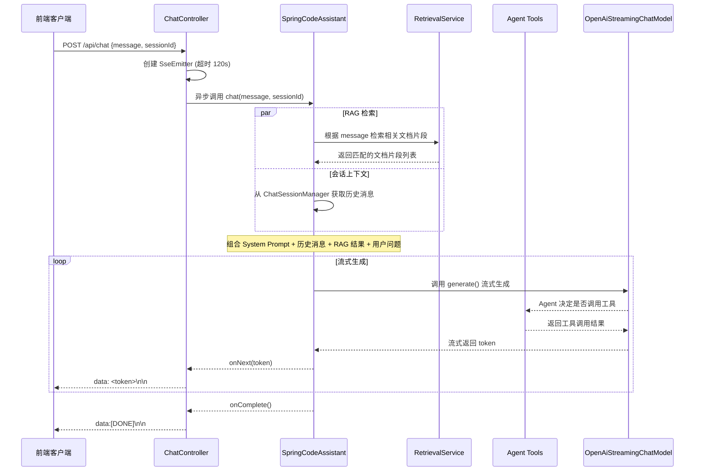

# F-01 智能对话（SSE 流式）

| 字段   | 值     |
|------|-------|
| 功能ID | F-01  |
| 模块   | 对话    |
| 优先级  | P0    |
| 版本   | V1.0  |
| 状态   | ✅ 已完成 |

---

## 1. 描述

用户发送消息，AI Agent 结合系统提示词 + RAG 检索内容 + 工具调用结果，通过 SSE 流式返回 AI 回复。

## 2. 用户故事

```
作为 [知识工作者]，我希望 [对上传的文档进行自然语言提问]，以便 [快速获取文档中的关键信息]。
作为 [研究人员]，我希望 [对上传的文献进行多轮追问]，以便 [深入理解文献内容]。
```

## 3. 前置条件

| 类型   | 条件                                            |
|------|-----------------------------------------------|
| 数据依赖 | 至少有一个文档已上传并完成向量化（否则 RAG 检索返回空，Agent 会告知无可用文档） |
| 系统依赖 | LLM API Key 已配置且校验通过                          |

## 4. 后置条件

| 变化     | 说明                   |
|--------|----------------------|
| 对话历史   | 用户消息和 AI 回复追加到当前会话历史 |
| 会话活跃时间 | 更新会话最后活跃时间，延迟自动清理计时  |

## 5. 接口规范

| 元素           | 说明                                                |
|--------------|---------------------------------------------------|
| 方法           | `POST /api/chat`                                  |
| Content-Type | `application/json`                                |
| Accept       | `text/event-stream`                               |
| 请求体          | `{"message": "用户问题", "sessionId": "会话ID"}`        |
| SSE 超时       | 120s（超过后服务端自动断开连接，需客户端重试）                         |
| 响应           | SSE 流，`data: <token>` 逐 token 推送，`data:[DONE]` 结束 |

### 请求体数据字典

| 字段名       | 类型           | 必填 | 说明                                            | 示例值                                    |
|-----------|--------------|----|-----------------------------------------------|----------------------------------------|
| message   | String(2000) | 是  | 用户输入的问题文本（校验 `@NotBlank` + `@Size(max=2000)`） | "Spring Boot 如何配置拦截器？"                 |
| sessionId | String(64)   | 否  | 会话标识，由前端生成（UUID）。为空时服务端使用 `"default"` 作为回退值   | "a1b2c3d4-e5f6-7890-abcd-ef1234567890" |

## 6. 业务流程



## 7. 异常/分支流程

| 场景         | 触发条件                         | 处理方式                                                            | 提示                                                                   |
|------------|------------------------------|-----------------------------------------------------------------|----------------------------------------------------------------------|
| message 为空 | 请求体缺少 message 字段或为空字符串       | 返回 400 错误                                                       | `"message 不能为空"`                                                     |
| message 超长 | message 超过 2000 字符           | 返回 400 错误                                                       | `"message 不能超过 2000 字符"`                                             |
| LLM 调用超时   | 第三方 LLM API 超时（> 30s）        | 服务端调用 `emitter.completeWithError()`，客户端触发 `EventSource.onerror` | 前端展示"服务暂不可用"                                                         |
| LLM 调用失败   | API Key 无效/额度耗尽/网络错误         | 服务端调用 `emitter.completeWithError()`，客户端触发 `EventSource.onerror` | 前端展示"服务暂不可用"                                                         |
| RAG 检索异常   | 向量库异常或检索失败                   | Agent 忽略 RAG 结果，仅基于 LLM 自身知识回答                                  | -                                                                    |
| SSE 连接中断   | 客户端断开连接（网络异常/浏览器关闭）          | 服务端 `onCompletion` 回调中调用 `future.cancel(true)` 取消 LLM 流式调用      | 已生成的部分回答不保留                                                          |
| 并发同会话对话    | 同一 sessionId 第二次请求到达时前一个仍在处理 | 后一个请求 `SseEmitter.completeWithError()`，返回 503                   | `"当前会话正在处理中，请稍后重试"`（通过 `ConcurrentHashMap` + `AtomicBoolean` 实现会话级锁） |

## 8. 数据字典 - SSE 协议

| 事件类型  | 数据格式                          | 说明       | 前端处理方式             |
|-------|-------------------------------|----------|--------------------|
| Token | `data:<文本片段>\n\n`             | 正常回复文本   | 拼接 token 渲染到界面     |
| Error | `data:{"error":"<错误信息>"}\n\n` | 异常事件     | 解析 JSON 后展示错误，关闭连接 |
| 结束    | `data:[DONE]\n\n`             | 流式输出结束标记 | 关闭连接，结束渲染          |
