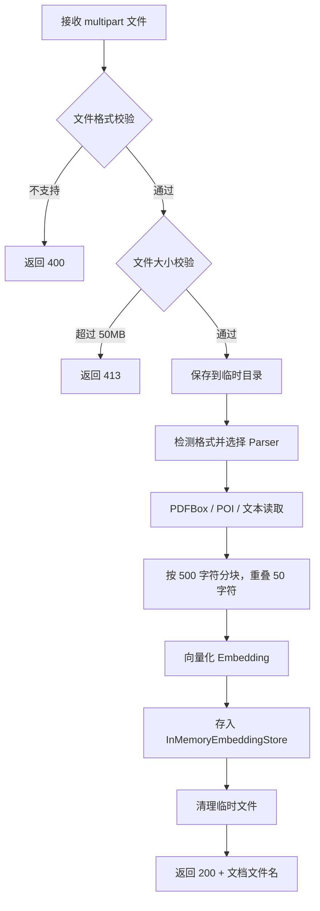

# F-04 上传文档

| 字段   | 值     |
|------|-------|
| 功能ID | F-04  |
| 模块   | 文档    |
| 优先级  | P0    |
| 版本   | V1.0  |
| 状态   | ✅ 已完成 |

---

## 1. 描述

上传文档并自动解析、分块、向量化后存入内存向量库，供后续 RAG 检索。

## 2. 用户故事

```
作为 [用户]，我希望 [上传文档到系统]，以便 [AI 能够基于我的文档内容回答问题]。
```

## 3. 前置条件

| 类型   | 条件                                                        |
|------|-----------------------------------------------------------|
| 文件校验 | 文件大小 ≤ 50MB（由 Spring `MaxUploadSizeExceededException` 拦截） |
| 文件校验 | 文件格式为 PDF / DOCX / DOC / TXT 之一                           |
| 文件校验 | 文件名经过 `Path.getFileName()` 清洗，防路径遍历                       |
| 系统依赖 | Embedding 模型可用（本地 ONNX 或远程 API）                           |

## 4. 后置条件

| 变化   | 说明                                                                                                          |
|------|-------------------------------------------------------------------------------------------------------------|
| 向量库  | 文档片段向量化后追加到 `InMemoryEmbeddingStore`                                                                        |
| 文档列表 | 文档文件名追加到 `DocumentController.uploadedDocuments`（`CopyOnWriteArrayList`），同时持久化到 `data/document-registry.txt` |
| 临时文件 | 上传的临时文件（`data/temp/`）在解析完成后通过 `Files.deleteIfExists()` 清理                                                   |

## 5. 接口规范

| 元素           | 说明                            |
|--------------|-------------------------------|
| 方法           | `POST /api/documents/upload`  |
| Content-Type | `multipart/form-data`         |
| 文件字段名        | `file`                        |
| 支持格式         | PDF, DOCX, DOC, TXT           |
| 大小限制         | 最大 50MB                       |
| 响应           | `AjaxResult`（成功时 data 为文档文件名） |

### 请求数据字典

| 字段名  | 类型   | 必填 | 说明               | 示例值                     |
|------|------|----|------------------|-------------------------|
| file | File | 是  | 上传文档文件           | -                       |
| 文件格式 | -    | 校验 | PDF/DOCX/DOC/TXT | "Spring Boot Guide.pdf" |
| 文件大小 | -    | 校验 | ≤ 50MB           | "10MB"                  |

### 响应数据字典

| 字段名  | 类型      | 必填 | 说明    | 示例值                     |
|------|---------|----|-------|-------------------------|
| code | Integer | 是  | 状态码   | 200                     |
| msg  | String  | 是  | 提示信息  | "上传成功"                  |
| data | String  | 是  | 文档文件名 | "Spring Boot Guide.pdf" |

## 6. 业务流程



## 7. 异常/分支流程

| 场景             | 触发条件                                                   | 处理方式                                                 | 提示                                                                          | 说明                                    |
|----------------|--------------------------------------------------------|------------------------------------------------------|-----------------------------------------------------------------------------|---------------------------------------|
| 未上传文件或参数名称错误   | 请求中没有 `file` 字段                                        | Spring 自动返回 400                                      | `"Required request part 'file' is not present"`                             | 由 Spring 框架自动处理                       |
| 文件过大           | 文件 > 50MB                                              | `GlobalExceptionHandler` 返回 413                      | `"File size exceeds the maximum allowed limit (50 MB)"`                     | 由 `MaxUploadSizeExceededException` 触发 |
| 格式不支持或解析/向量化失败 | 文件后缀不对 / PDF 损坏 / DOCX 加密 / 编码异常 / Embedding 异常 / 磁盘不足 | 捕获所有 `Exception`，返回 HTTP 200 + `AjaxResult.failed()` | `"Failed to process document. Please check the file format and try again."` | 当前未区分具体错误类型，统一返回通用错误                  |
| 同名文件重复上传       | 上传已存在文件名的文档                                            | 追加到向量库，不覆盖                                           | -                                                                           | 同一文档重复上传会导致向量库中有两份，但不阻塞操作             |
