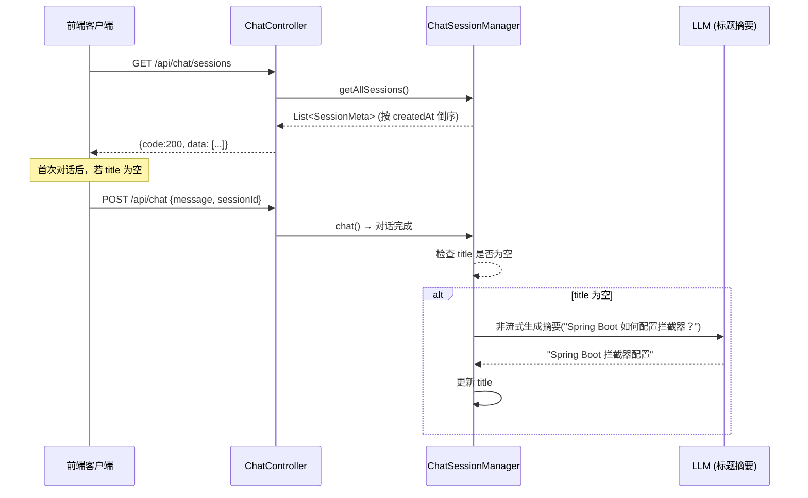

# F-08 会话列表

| 字段   | 值     |
|------|-------|
| 功能ID | F-08  |
| 模块   | 对话    |
| 优先级  | P1    |
| 版本   | V1.1  |
| 状态   | ✅ 已完成 |

---

## 1. 描述

返回所有活跃会话的元数据列表。每次用户发起对话时，系统自动根据第一轮用户消息摘要生成会话标题；用户可后续手动修改。

## 2. 用户故事

```
作为 [用户]，我希望 [查看所有历史会话的列表]，以便 [快速找到之前的对话并继续讨论]。
作为 [用户]，我希望 [列表展示会话标题、消息条数和时间]，以便 [快速识别会话内容]。
```

## 3. 前置条件

无（空列表时返回 `[]`）。

## 4. 后置条件

无状态变更。

## 5. 会话元数据模型

| 字段           | 类型          | 必填 | 说明                | 生成方式             |
|--------------|-------------|----|-------------------|------------------|
| sessionId    | String(64)  | 是  | 会话唯一标识（UUID）      | 前端生成             |
| title        | String(100) | 否  | 会话标题，为空时前端展示"新会话" | AI 自动摘要 或 用户手动设置 |
| createdAt    | Long        | 是  | 创建时间戳（ms）         | 首次对话时记录          |
| lastActiveAt | Long        | 是  | 最后活跃时间戳（ms）       | 每次对话更新           |
| messageCount | Integer     | 是  | 消息总条数（用户 + AI）    | 每次对话递增           |

### 标题自动摘要规则

- **触发时机**：每轮对话完成后，如果该会话 `title` 为空，则以**第一轮用户消息**作为输入调用 LLM 生成简短标题（≤ 20 字）
- **幂等性**：标题生成后不再自动覆盖，除非用户主动触发「重新生成标题」
- **LLM 调用**：复用现有的 `OpenAiStreamingChatModel`，非流式单次调用
- **超时处理**：LLM 生成超时（> 5s）则跳过，下次对话时重试

## 6. 接口规范

| 元素   | 说明                           |
|------|------------------------------|
| 方法   | `GET /api/chat/sessions`     |
| 请求参数 | 无                            |
| 排序   | **按创建时间倒序**（最新创建的排最前）        |
| 响应   | `AjaxResult` — data 为会话元数据数组 |

### 响应数据字典

| 字段名                 | 类型            | 必填 | 说明      | 示例值                 |
|---------------------|---------------|----|---------|---------------------|
| code                | Integer       | 是  | 状态码     | 200                 |
| msg                 | String        | 是  | 提示信息    | "success"           |
| data                | SessionMeta[] | 是  | 会话元数据数组 | —                   |
| data[].sessionId    | String        | 是  | 会话 ID   | "a1b2c3d4-..."      |
| data[].title        | String        | 否  | 会话标题    | "Spring Boot 配置拦截器" |
| data[].createdAt    | Long          | 是  | 创建时间戳   | 1718000000000       |
| data[].lastActiveAt | Long          | 是  | 最后活跃时间戳 | 1718003600000       |
| data[].messageCount | Integer       | 是  | 消息总条数   | 6                   |

## 7. 业务流程



## 8. 异常/分支流程

| 场景       | 触发条件        | 处理方式            | 提示   |
|----------|-------------|-----------------|------|
| 无任何会话    | 会话管理器为空     | 返回空数组           | `[]` |
| 标题自动摘要失败 | LLM 调用超时/异常 | 静默跳过，title 保持为空 | —    |
| 会话已过期被清理 | 30 分钟未活跃    | 不返回该会话（同不存在）    | —    |
